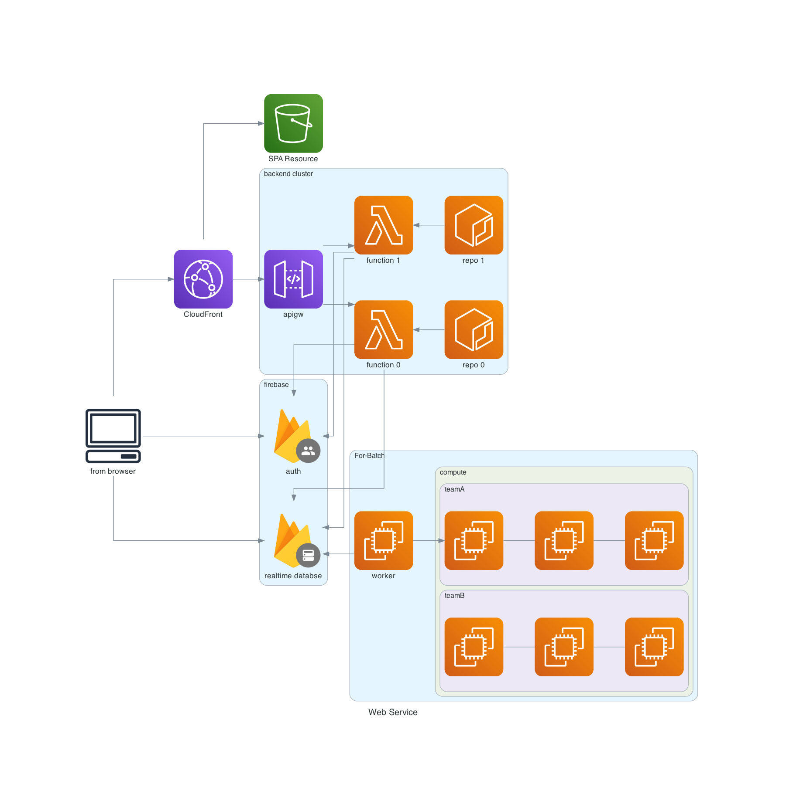
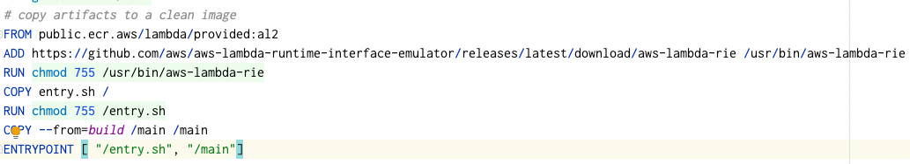
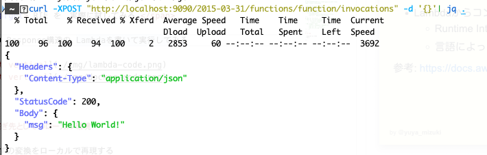
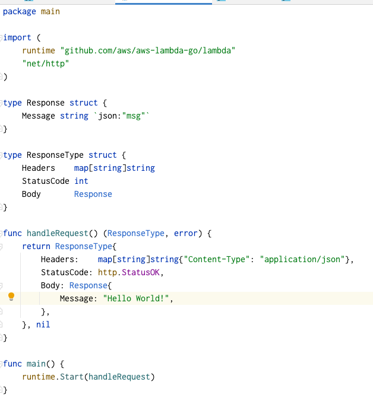
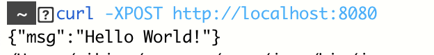
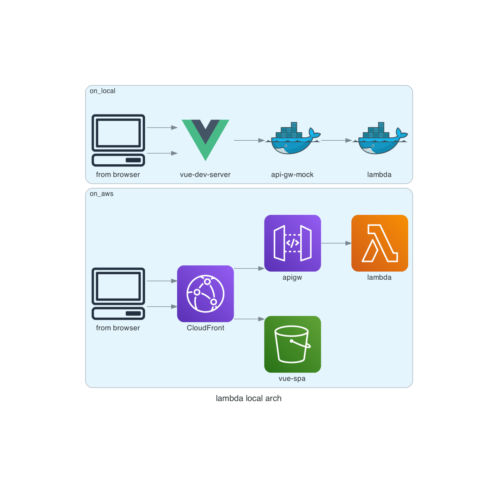
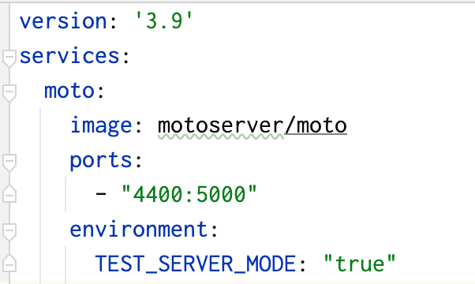
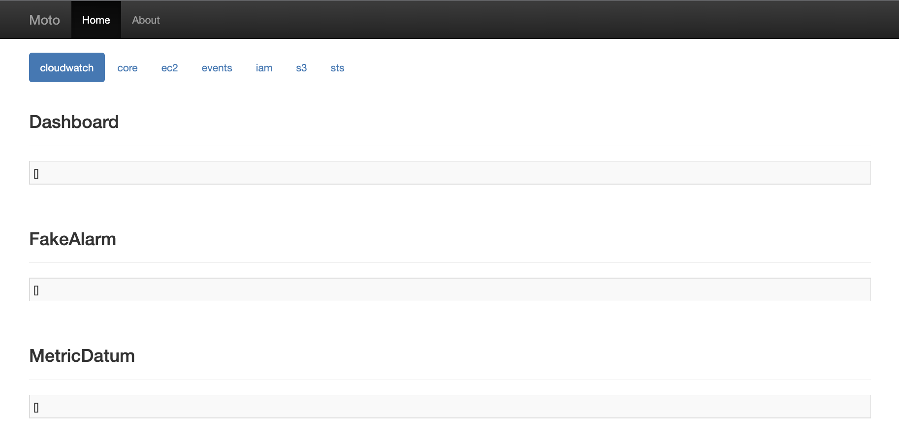
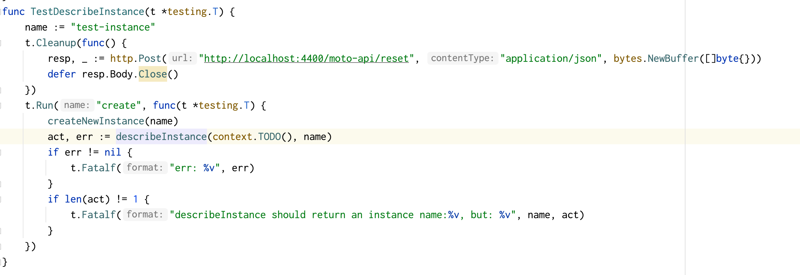

<!--
class: title
-->

# Web APIとしてのAWS Lambdaのローカル開発環境の話
---
<!--
class: slides
-->

# 導入: とある日

こんなものを作ろうとしていました

-  Web Service本体 <-*今回話す部分*
    - SPA + Lambda の構成
    - Proxy統合の利用
- データ保管 (Firebase)
- バッチ処理 (EC2などのインスタンス群)

---
# 導入: 困りごと

意気揚々と取り組んでいたが...

- フロントエンドを書けば、APIとして叩く先の準備に困る
- バックエンドを書けば、他のAWSサービスとの連携に困る
 

さて、ローカルでどうやって試そう？(どうやってテストしよう？)

---
# 導入

AWS Lambda のローカルの開発環境の話

~ Lambda RIE と moto の紹介 ~

---

# ゴール

- frontに対して、Fake Serverを提供できるようにする
    - 固定値を返すmockでもいいけど、状態変化をブラウザ経由で確認したい時に、ある程度動的なFake Serverがあると嬉しいので
- テストについては下記の方針
    - UT (small)
        - 通常の言語ごとのテストで担保する
    -  アプリケーション外への通信が必要なテスト(medium) 
        - API Call部分やDBアクセス
        - 複数の操作による状態変化の確認
    - AWSのリソースを含めた全体での統合テスト(large)
        - ローカルでは全く担保せず、AWS環境を利用する
---

# ローカル開発環境を作る上で考えること
- Lambda"を"利用する側への準備
- Lambda"から"利用する側への準備

---

# ローカル開発環境を作る上で考えること
- Lambda"を"利用する側への準備 
    - フロントからの繋ぎ先としてのローカル環境
- Lambda"から"利用する側への準備
    - DataAccess系 (サラッと)
    - AWS API Call系

---
# フロントからの繋ぎ先としてのローカル環境

 Lambda を ローカルで動かす?

できれば、AWS上で動くものと同じように動かしたいが...

- 実行環境について =  デプロイについて
    - コンテナイメージを利用する
        - Lambda は コンテナによるデプロイも可能になっている（昔は zip形式しかなかった...)
- lambda の handler に event情報を渡す部分について
    - http request/response　として emulation する仕組みの導入
    - 公式配布の Runtime Interface Emulator(RIE) を利用

参考: https://docs.aws.amazon.com/ja_jp/lambda/latest/dg/images-test.html

---
# フロントからの繋ぎ先としてのローカル環境(RIEを試す)

コンテナを定義する

起動して、RIEを試す

---

# フロントからの繋ぎ先としてのローカル環境(RIEを試す)

- 期待する形式にならない（下記が別形式)
    - Lambdaの input/output event
    - フロントの期待する API GW 経由のresponse　

Lambdaから受け取るResponse(Event)から変形して、フロントに返すmockが必要

---
# フロントからの繋ぎ先としてのローカル環境(RIE用の変換器)

PoC的に bodyだけ返す 変換器 を作成
- [api-gateway-rie-mock](https://github.com/mikiya771/api-gateway-rie-mock) (とりあえず動くだけのもの)

変換器経由でRIEにリクエストを送ると bodyだけになる↓

(参考)AWS資料: [Proxy統合フォーマット](https://docs.aws.amazon.com/ja_jp/apigateway/latest/developerguide/set-up-lambda-proxy-integrations.html#api-gateway-simple-proxy-for-lambda-output-format)

---
# フロントからの繋ぎ先としてのローカル環境(CORS問題)

フロントから呼び出す場合、CORSの問題がある。

AWS環境ではCloudFrontを経由することで解決している

→Front側のフレームワーク付随のdevServerを利用

---
# フロントからの繋ぎ先としてのローカル環境(まとめ)

- CloudFrontによる変換
    - SPA側のDevServerに付随のProxy機能で担保
- API Gateway → Lambda で起きることを担保する
    - RIE + 独自の変換器の利用
    

---
# ローカル開発環境でのチェック環境
- Lambda"を"利用する側への準備
    - フロントの繋ぎ先としてのローカル環境
- Lambda"から"利用する側への準備
    -  Database系（サラッと） 
    -  AWS API Call系

---

# Lambda"から"利用する側への準備(Database編)

さらっと紹介

- MySQL
    - docker
- Firebase RealtimeDatabase
    - [firebase emulator (公式配布)](https://firebase.google.com/docs/emulator-suite?hl=ja )
- DynamoDB
    - [dynamodb local (公式配布)](https://docs.aws.amazon.com/ja_jp/amazondynamodb/latest/developerguide/DynamoDBLocal.html)
    
--- 
# Lambdaからの連携先のLocalでの扱い(AWS API Call)
リクエストの形式と返り値の検証・ローカル起動時のmockを目的とする

 motoを利用する 
https://github.com/spulec/moto

- AWS ServiceのMock用のライブラリ (by Python)
    - 内容
        - 完全に状態管理できるわけではないが、簡易的に状態込みで管理してくれる(EC2の台数など)
    - 使い方
        - Python上で直接呼び出して利用可能
        -  サーバーモードで起動して、SDK・CLIにendpointを指定して利用可能

---
# Lambdaからの連携先のLocalでの扱い(moto)
準備

- docker-composeを書いて、実行する
    - 数秒で立ち上がる
- Dashboardがあるので、繋いでみる
    - dashboard経由でリソースの状態を確認できる

---
# Lambdaからの連携先のLocalでの扱い(moto)

サクッとテストも試してみる

- reset APIが生えているので、テスト用に叩く
- aws sdkはAPI Endpointを上書き指定できるのでmotoに向ける
- instanceをセットアップした上で、describeして確認する

---
# まとめ

Lambda RIE と moto server は意外と便利。
うまく利用すると、AWSのサービスとくっつきがちな部分でも、
- mediumレベルのテストとしてローカルでテストできる
- localである程度動的に動くものとして、フロントにある種のFake Serverを提供できる

テストについては、
[Testable Lambda｜AWS Summit Tokyo 2017](https://www.youtube.com/watch?v=C0zNc4bdWhY) をみると良いです。（こっちはlocalstack使っている)

---

# おまけ: 今回とは別の選択肢

`Serverless Framework` のpluginを利用すればローカルでもいけそうだが？

- `CFn系 (Serverless Framework, AWS CDK ...)` か  `Terraform系` か 統一したい

→ 今回は Terraform系に揃える前提で、 `Serverless Framework` に乗っからない前提にした

なお、今回の方法だと、普通に docker-compose書くので、moto serverの追加など拡張はさせやすかった。

---
# おまけ: 今回とは別の選択肢

`localstack` を `moto` の代わりに利用する？
下記の理由で断念
- 無料だと一部機能しか使えない
- かなり機能が充実している分、ローカルで動かすにはやや重たい
---

# おまけ(時間がとても余ったら)

Diagram as Code とか Marp とか
    
