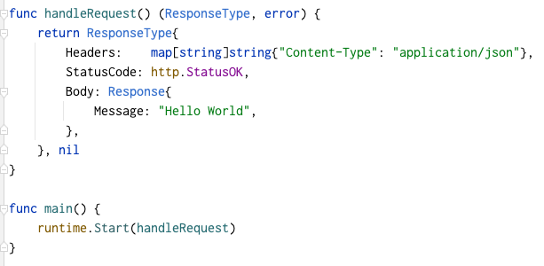

<!--
class: title
-->

# AWS Lambdaのローカル開発紹介
---
<!--
class: slides
-->

# なんの話？

- 文脈について
    - 個人開発
- 作るものについて
    - What
        - サーバーレスっぽいアーキテクチャ
- LTで話すこと
    - Serverless Frameworkに乗っからない場合のローカルの開発とテストのこと
        - Lambda RIE と moto の紹介

---
# 作ろうとしているアーキテクチャの全体像(概要)
-  Web Service本体 <-*今回話す部分*
    - SPA + Lambda の構成 (TS/JS)
    - Proxy統合の利用
- データ保管 (Firebase)
- バッチ処理 (EC2などのインスタンス群)

---
# 作ろうとしているアーキテクチャの全体像(前提)

- serverless frameworkで管理しきれない部分もある (EC2の部分など)
- AWS APIを叩く形のIaCツールは一つに絞りたい (CFn系列 or  Terraform系列 )

 

    Serverless Frameworkに乗っからない場合の 
    Lambdaのローカル開発環境

---

# ローカル開発環境でのチェック環境
- Lambda"を"利用する側への準備 
    - フロントからの繋ぎ先としてのローカル環境
- Lambda"から"利用する側への準備
    - DataAccess系
    - AWS API Call系

---
# フロントからの繋ぎ先としてのローカル環境

 Lambda を ローカルで動かす?
- そもそも Lambda は コンテナによるデプロイも可能になっている
- Lambdaからコンテナへのinput/outputのemulatorが存在する
    - Runtime Interface Emulator (RIE) と呼ばれる
    - 公式配布のベースイメージにもともと含まれていたり(言語による)

参考: https://docs.aws.amazon.com/ja_jp/lambda/latest/dg/images-test.html

---
# フロントからの繋ぎ先としてのローカル環境

RIE を実際に試してみる

- Proxy統合用の Response構造で handler作成
- RIEを含んだContainer Imageを作成
- curlで試し打ち

ちょっと困ること  
起動用の特殊な Pathへのアクセス  
レスポンスの構造が API Gateway向け

---
# フロントからの繋ぎ先としてのローカル環境

Lambda Proxy統合 の役割を果たすmockを用意する

 

こういう感じ: https://github.com/mikiya771/api-gateway-rie-mock (とりあえず動くだけのものでwip)

(参考)AWS資料: [Proxy統合フォーマット](https://docs.aws.amazon.com/ja_jp/apigateway/latest/developerguide/set-up-lambda-proxy-integrations.html#api-gateway-simple-proxy-for-lambda-output-format)

---
# フロントからの繋ぎ先としてのローカル環境

フロントから呼び出す場合、CORSの問題がある。

AWS環境ではCloudFrontを経由することで解決している

→Front側のフレームワーク付随のdevServerを利用

---
# フロントからの繋ぎ先としてのローカル環境(まとめ)

- CloudFrontによる変換
    - SPA側のDevServerに付随のProxy機能で担保
- API Gateway → Lambda で起きることを担保する
    - API GatewayによるRIEのための変換を独自のmockで担保
    

---
# ローカル開発環境でのチェック環境
- Lambda"を"利用する側への準備
    - SPAの繋ぎ先としてのローカル環境
- Lambda"から"利用する側への準備
    -  Database系（サラッと） 
    -  AWS API Call系

---

# Lambda"から"利用する側への準備(前提)

- frontでの開発から接合する場合は、全て docker-composeでmockして一定動くようにする
- テストについては下記の方針
    - AWSのリソースを含めた全体での統合テスト
        - ローカルではやらず、AWS環境を利用する
    - 状態の変化を含むテスト
        - 状態を持つ部分をコンテナで立ち上げてテストする
    - それ以外
        - 通常の言語ごとのテストで担保する
---

# Lambda"から"利用する側への準備(Database編)

さらっと紹介

- MySQL
    - docker
- Firebase RealtimeDatabase
    - [firebase emulator (公式配布)](https://firebase.google.com/docs/emulator-suite?hl=ja )
- DynamoDB
    - [dynamodb local (公式配布)](https://docs.aws.amazon.com/ja_jp/amazondynamodb/latest/developerguide/DynamoDBLocal.html)
    
--- 
# Lambdaからの連携先のLocalでの扱い(AWS API Call)
リクエストの形式と返り値の検証・ローカル起動時のmockを目的とする

 motoを利用する 
https://github.com/spulec/moto

- AWS ServiceのMock用のライブラリ (by Python)
    - 内容
        - 完全に状態管理できるわけではないが、簡易的に状態込みで管理してくれる(EC2の台数など)
    - 使い方
        - Python上で直接呼び出して利用可能
        -  サーバーとして起動して、SDK・CLIにendpointを指定して利用可能

---
# Lambdaからの連携先のLocalでの扱い(moto)
準備

- docker-composeを書いて、実行する
    - 簡単に立ち上がる
- Dashboardがあるので、繋いでみる
    - dashboard経由でリソースの状態を確認できる

---
# Lambdaからの連携先のLocalでの扱い(moto)

サクッとテストも試してみる

- reset APIが生えているので、テスト用に叩く
- aws sdkはAPI Endpointを上書き指定できるのでmotoに向ける
- instanceをセットアップした上で、describeして確認する

---
# まとめ

Lambda RIE と moto server は意外と便利で、
AWSのサービスとくっつきがちな部分でも、
- ローカルである程度のテストがしやすくなる
- フロントのLocalでの繋ぎ先としての機能を果たさせやすくなる

---
# おまけ(時間がとても余ったら)

Diagram as Code とか Marp とか
    
